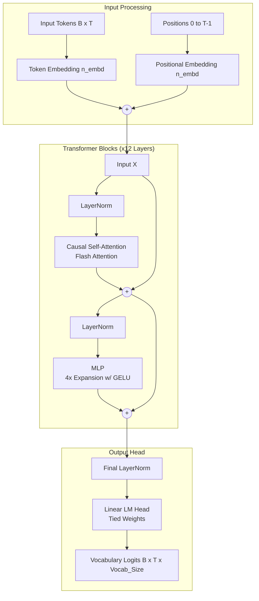

# DeepSeek Scratch: GPT-2 Implementation

## Project Introduction

This project is a clean, from-scratch implementation of the Generative Pre-trained Transformer 2 (GPT-2) architecture using PyTorch. The goal of this project is to demystify the inner workings of large language models by building one from the ground up, implementing everything from the core Transformer blocks to the data loading and training loop. It includes robust features like Flash Attention for optimized performance, distributed data parallel (DDP) training for multi-GPU scaling, and mixed-precision (bfloat16) operations to accelerate training time while reducing memory footprint.

## Step-wise Implementation Detail

1. **Architecture Definition**: The model architecture is built incrementally. First, the `CausalSelfAttention` class is created to handle the multi-headed masked attention. We use `torch.nn.functional.scaled_dot_product_attention` to leverage Flash Attention, which significantly boosts computation speed by avoiding the materialization of large attention matrices in High Bandwidth Memory (HBM). This eliminates the $O(T^2)$ memory bottleneck common in standard attention mechanisms.
2. **Multi-Layer Perceptron (MLP)**: The feedforward neural network layer is implemented with an expansion factor of 4 and a Gaussian Error Linear Unit (GELU) activation function, specifically using the `tanh` approximation, mimicking the original OpenAI implementation.
3. **Transformer Block**: The `Block` class brings together the LayerNorms, the `CausalSelfAttention`, and the `MLP`, wrapping them in residual connections. This facilitates clean gradient flow through deep networks.
4. **Model Assembly**: The `GPT` module holds the token embeddings (`wte`), position embeddings (`wpe`), and a stack of Transformer blocks. Weight tying is applied between the token embeddings and the language model head (`lm_head.weight = wte.weight`) to save parameters and improve regularization. We also implement customized weight initialization to scale down weights in residual layers (`1/sqrt(2*L)`).
5. **Data Loading**: The `DataLoaderLite` class handles efficient loading of training data. It reads pre-tokenized numpy arrays from disk and batches them, ensuring that the model receives sequence chunks (`B` x `T`) smoothly. It handles sharded datasets perfectly, automatically advancing shards during training.
6. **Training Loop**: The training loop encompasses a linear warmup with cosine decay learning rate schedule. We accumulate gradients over several micro-steps to simulate a much larger effective batch size (e.g., 500,000 tokens per batch), and use Distributed Data Parallel (DDP) to distribute these micro-batches across available GPUs. We apply weight decay via the fused AdamW optimizer, selectively avoiding decay on biases and 1D normalization parameters. Gradient clipping at a global norm of 1.0 is used to prevent unstable gradients.
7. **Evaluation**: Periodically, the model evaluates itself on a validation set for perplexity/loss and performs a zero-shot multiple-choice evaluation on the HellaSwag dataset to monitor language understanding capabilities. During evaluation, we use `torch.no_grad()` and evaluate over multiple batches for stability.

## Key Architectural Details & Optimizations

Based on exploratory notes in `training_gpt2.ipynb`, the following architectural optimizations are implemented:
- **Differences from the Original Transformer**: GPT-2 is a decoder-only architecture (no encoder, no multihead cross-attention). Furthermore, layer normalization is reshuffled to a pre-normalization scheme, and an extra layer normalization is added after the final self-attention block.
- **Weight Tying**: The model shares the same weight matrix between the input token embeddings (`wte`) and the pre-softmax linear transformation (`lm_head`). This enforces the concept that when predicting the next token, the hidden state should score highly against tokens whose embeddings are inherently similar.
- **Vocabulary Padding for CUDA Optimizations**: The model's vocab size is artificially bumped from 50,257 to 50,304. Since 50,304 is a highly composite "nice" number (a multiple of large powers of two), CUDA kernels can utilize perfectly aligned block tiles, avoiding the slow-path computation overhead associated with "ugly" dimensions.
- **Residual Initialization Scaling**: The variance of activations grows with depth because every residual block essentially performs `x = x + F(x)`. To prevent activations from exploding, we scale the standard deviation of the weight initialization by $\frac{1}{\sqrt{2L}}$ (where $L$ is the number of layers, multiplied by 2 for the MLP and Attention branches).


## References Used

- [GPT-2 Paper: Language Models are Unsupervised Multitask Learners (OpenAI)](https://cdn.openai.com/better-language-models/language_models_are_unsupervised_multitask_learners.pdf)
- [GPT-3 Paper: Language Models are Few-Shot Learners (OpenAI)](https://arxiv.org/pdf/2005.14165)
- [GELU Paper: Gaussian Error Linear Units](https://arxiv.org/pdf/1606.08415)
- [FlashAttention: Fast and Memory-Efficient Exact Attention with IO-Awareness](https://arxiv.org/abs/2205.14135)

## Data Used

- **Pretraining Data (FineWeb-Edu)**: The primary training dataset utilized is a sampled subset of `HuggingFaceFW/fineweb-edu` (specifically `sample-10BT`). The `fineweb.py` script downloads, tokenizes using the GPT-2 BPE tokenizer (tiktoken), and serializes the documents into shards of uint16 numpy arrays for highly efficient disk-to-memory streaming.
- **Evaluation Data (HellaSwag)**: For validation, the HellaSwag dataset is used. The `helloswag.py` script fetches the evaluation data and parses the context and completions to test the model's common-sense reasoning directly against OpenAI's GPT-2 baselines.

## Project Structure and Files Details

The repository contains several key files involved in the training pipeline. Below is a detailed description of each file and its contents:

### 1. Model & Training Architecture
- **`model.py`**: The core standalone Python script for distributed training on local multi-GPU setups. 
  - **Contents**: It contains the `GPT` model architecture implementation (including `CausalSelfAttention` with Flash Attention, `MLP`, and `Block`), configuration (`GPTConfig`), and a custom `DataLoaderLite` for streaming tokenized shards. It implements the full training loop with Distributed Data Parallel (DDP), mixed-precision (`bfloat16`), a cosine decay learning rate schedule with warmup, and gradient accumulation. It also runs periodic validation and HellaSwag evaluation.
- **`train_colab.py`**: A specialized training script adapted for Google Colab background execution.
  - **Contents**: Contains the identical model architecture and training loop as `model.py`, but includes logic for Google Drive mounting, saving/loading checkpoints directly to/from Drive (`checkpoint.pt`), and background execution support (e.g., `nohup`).
- **`training_gpt2.ipynb`**: An interactive Jupyter Notebook version of the training script.
  - **Contents**: It is identical in logic to `model.py` but is formatted for exploratory execution, debugging, and sequential cell-by-cell walkthroughs. It is excellent for prototyping new architectural changes.

### 2. Data Preparation & Evaluation
- **`fineweb.py`**: Handles dataset preparation for pretraining.
  - **Contents**: A script that downloads the FineWeb-Edu dataset (`sample-10BT`) in streaming mode from Hugging Face, tokenizes the text using the GPT-2 BPE tokenizer (`tiktoken`), and serializes it into `uint16` binary numpy arrays (shards of 50M tokens each). This format allows for highly efficient disk-to-memory streaming during training.
- **`helloswag.py`**: Handles zero-shot evaluation on the HellaSwag dataset.
  - **Contents**: Contains functions to download the HellaSwag validation dataset and parse the contexts and completions. It evaluates the model's likelihood for each of the four possible completions and determines the accuracy against OpenAI's GPT-2 baselines.

### 3. Monitoring & Analysis
- **`app.py`**: A Streamlit web dashboard to monitor training progress interactively.
  - **Contents**: A web app that reads the latest metrics from `log/log.txt` and displays the real-time training loss, validation loss, and HellaSwag evaluation metrics. It also presents training graphs and the raw log data.
- **`log.ipynb`**: An analysis notebook designed to parse the `log/log.txt` output file. 
  - **Contents**: It extracts the telemetry logged during training (step, loss, validation loss, and HellaSwag accuracy) over time and plots learning curves using Matplotlib, generating visualizations like `training_plot.png`.
- **`log/log.txt`**: The text file containing telemetry logged during training.
- **`data/`**: The directory where FineWeb dataset shards are stored.
- **`hellaswag/`**: Directory for caching the downloaded HellaSwag JSONL files.

## Syncing model.py and training_gpt2.ipynb

Both `model.py` and `training_gpt2.ipynb` contain the exact same architecture and training logic. `model.py` is intended for long-running, multi-GPU training sessions using the terminal, whereas `training_gpt2.ipynb` is an interactive scratchpad. 

**Best Practices for Syncing:**
When developing new features (e.g., adding a new type of normalization or changing the attention mechanism), it is recommended to prototype in `training_gpt2.ipynb`. Once the logic is verified and functioning correctly, copy the updated classes or functions directly into `model.py`. Always ensure that any changes to the `GPTConfig` or `GPT` module in the notebook are mirrored in the Python script before kicking off a full training run.

## Run Script

To run the full training script on a single machine with multiple GPUs (e.g., 8 GPUs), use the `torchrun` module to launch `model.py`:

```bash
torchrun --standalone --nproc_per_node=8 model.py
```

If you only have a single GPU (or wish to run on CPU), you can simply run it directly:

```bash
python model.py
```
The script will automatically detect whether it is running in a Distributed Data Parallel (DDP) environment and configure the devices accordingly.

## Architecture Diagram

The GPT-2 model implemented in this project follows a decoder-only Transformer architecture. Below is a detailed Mermaid diagram illustrating the flow of data from input tokens to output logits.



## License

This project is licensed under the MIT License. See the [LICENSE](file:///d:/document/projects/deepseek_scratch/LICENSE) file for more details. The MIT License is a permissive free software license originating at the Massachusetts Institute of Technology (MIT). It puts only very limited restriction on reuse and has, therefore, an excellent license compatibility.
