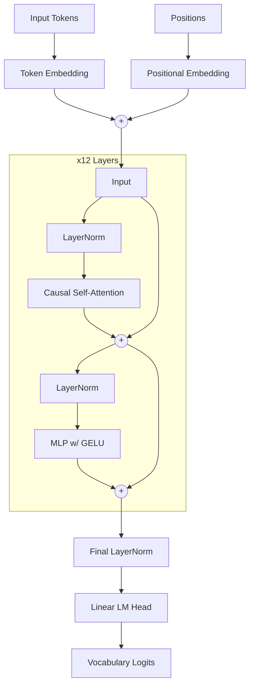

# DeepSeek Scratch: GPT-2 Implementation

## Project Introduction

This project is a clean, from-scratch implementation of the Generative Pre-trained Transformer 2 (GPT-2) architecture using PyTorch. The goal of this project is to demystify the inner workings of large language models by building one from the ground up, implementing everything from the core Transformer blocks to the data loading and training loop. It includes robust features like Flash Attention for optimized performance, distributed data parallel (DDP) training for multi-GPU scaling, and mixed-precision (bfloat16) operations to accelerate training time while reducing memory footprint.

## Step-wise Implementation Detail

1. **Architecture Definition**: The model architecture is built incrementally. First, the `CausalSelfAttention` class is created to handle the multi-headed masked attention. We use `torch.nn.functional.scaled_dot_product_attention` to leverage Flash Attention, which significantly boosts computation speed by avoiding the materialization of large attention matrices in High Bandwidth Memory (HBM).
2. **Multi-Layer Perceptron (MLP)**: The feedforward neural network layer is implemented with an expansion factor of 4 and a Gaussian Error Linear Unit (GELU) activation function, mimicking the original OpenAI implementation.
3. **Transformer Block**: The `Block` class brings together the LayerNorms, the `CausalSelfAttention`, and the `MLP`, wrapping them in residual connections.
4. **Model Assembly**: The `GPT` module holds the token embeddings, position embeddings, and a stack of Transformer blocks. Weight tying is applied between the token embeddings and the language model head.
5. **Data Loading**: The `DataLoaderLite` class handles efficient loading of training data. It reads pre-tokenized numpy arrays from disk and batches them, ensuring that the model receives sequence chunks (`B` x `T`) smoothly. It handles sharded datasets perfectly.
6. **Training Loop**: The training loop encompasses a linear warmup with cosine decay learning rate schedule. We accumulate gradients over several micro-steps to simulate a much larger effective batch size (e.g., 500,000 tokens per batch), and use Distributed Data Parallel (DDP) to distribute these micro-batches across available GPUs. We apply weight decay via the fused AdamW optimizer, selectively avoiding decay on biases and 1D normalization parameters.
7. **Evaluation**: Periodically, the model evaluates itself on a validation set for perplexity/loss and performs a zero-shot multiple-choice evaluation on the HellaSwag dataset to monitor language understanding capabilities.

## References Used

- [GPT-2 Paper: Language Models are Unsupervised Multitask Learners (OpenAI)](https://cdn.openai.com/better-language-models/language_models_are_unsupervised_multitask_learners.pdf)
- [GPT-3 Paper: Language Models are Few-Shot Learners (OpenAI)](https://arxiv.org/pdf/2005.14165)
- [GELU Paper: Gaussian Error Linear Units](https://arxiv.org/pdf/1606.08415)
- [FlashAttention: Fast and Memory-Efficient Exact Attention with IO-Awareness](https://arxiv.org/abs/2205.14135)

## Data Used

- **Pretraining Data (FineWeb-Edu)**: The primary training dataset utilized is a sampled subset of `HuggingFaceFW/fineweb-edu` (specifically `sample-10BT`). The `fineweb.py` script downloads, tokenizes using the GPT-2 BPE tokenizer (tiktoken), and serializes the documents into shards of uint16 numpy arrays for highly efficient disk-to-memory streaming.
- **Evaluation Data (HellaSwag)**: For validation, the HellaSwag dataset is used. The `helloswag.py` script fetches the evaluation data and parses the context and completions to test the model's common-sense reasoning directly against OpenAI's GPT-2 baselines.

## Project Structure and Files Details

- `model.py`: The core standalone Python script containing the GPT-2 model definition, data loader, optimizer configuration, DDP logic, and the complete training loop.
- `training_gpt2.ipynb`: An interactive Jupyter Notebook version of `model.py`. It is identical in logic but formatted for exploratory execution, debugging, and sequential cell-by-cell walkthroughs.
- `fineweb.py`: A script responsible for downloading and tokenizing the FineWeb-Edu dataset into binary numpy shards located in the `data/` directory.
- `helloswag.py`: Handles downloading the HellaSwag evaluation dataset and evaluating the current model checkpoint against the dataset's multiple-choice format.
- `log.ipynb`: An analysis notebook designed to parse the `log/log.txt` output file. It extracts the training loss, validation loss, and HellaSwag accuracy over time and generates visualizations.
- `log/log.txt`: The text file containing telemetry logged during training (step, loss, norm, tokens/sec, validation loss, and HellaSwag accuracy).
- `app.py`: A Streamlit web dashboard to monitor training progress interactively, presenting real-time loss graphs and evaluation metrics.
- `data/`: The directory where dataset shards are stored.
- `hellaswag/`: Directory for caching the downloaded HellaSwag JSONL files.

## Syncing model.py and training_gpt2.ipynb

Both `model.py` and `training_gpt2.ipynb` contain the exact same architecture and training logic. `model.py` is intended for long-running, multi-GPU training sessions using the terminal, whereas `training_gpt2.ipynb` is an interactive scratchpad. 

**Best Practices for Syncing:**
When developing new features (e.g., adding a new type of normalization or changing the attention mechanism), it is recommended to prototype in `training_gpt2.ipynb`. Once the logic is verified and functioning correctly, copy the updated classes or functions directly into `model.py`. Always ensure that any changes to the `GPTConfig` or `GPT` module in the notebook are mirrored in the Python script before kicking off a full training run.

## Run Script

To run the full training script on a single machine with multiple GPUs (e.g., 8 GPUs), use the `torchrun` module to launch `model.py`:

```bash
torchrun --standalone --nproc_per_node=8 model.py
```

If you only have a single GPU (or wish to run on CPU), you can simply run it directly:

```bash
python model.py
```
The script will automatically detect whether it is running in a Distributed Data Parallel (DDP) environment and configure the devices accordingly.

## Architecture Diagram
- 
- 
- 


